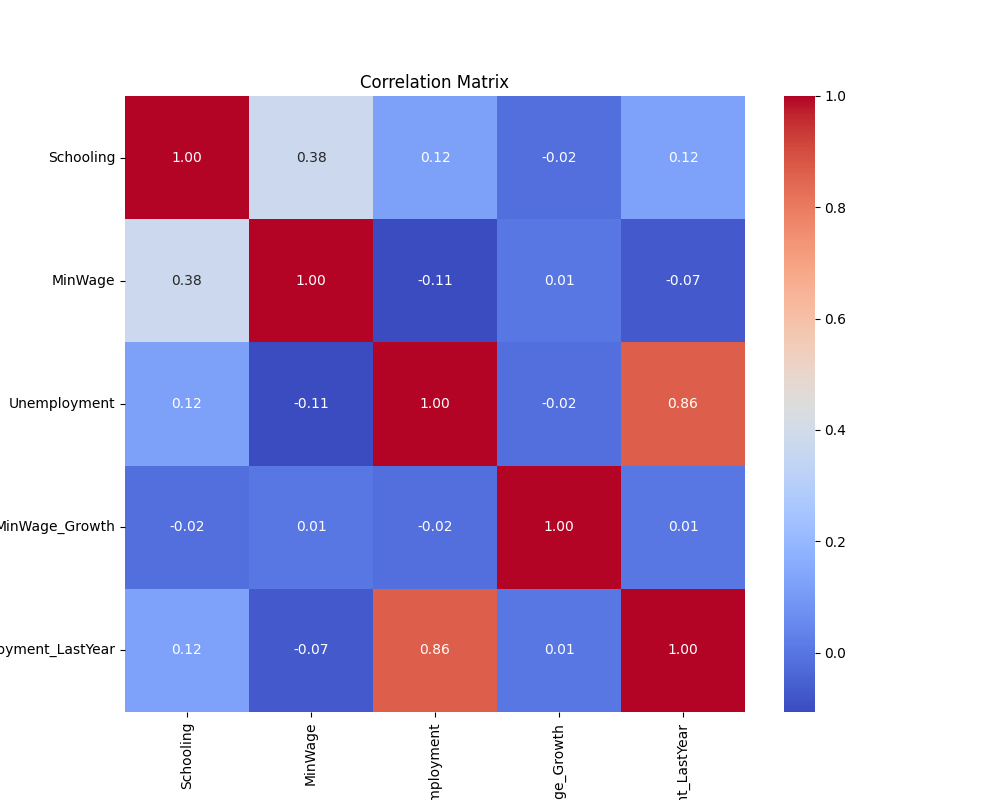
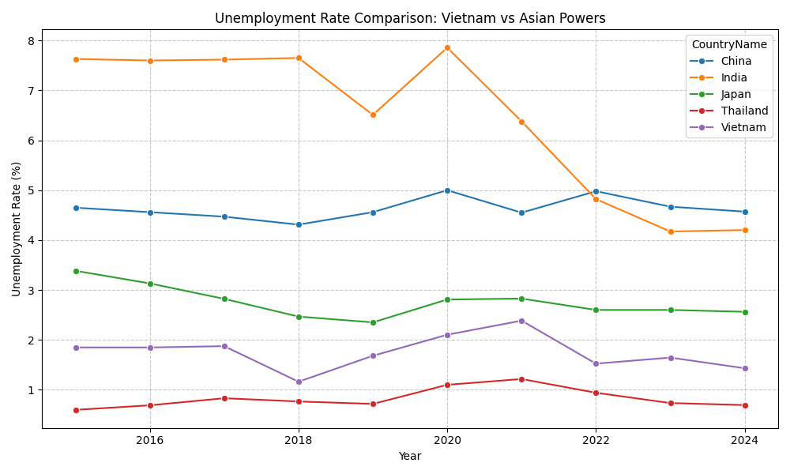

# BÁO CÁO TIẾN ĐỘ DỰ ÁN: PHÂN TÍCH & DỰ BÁO THẤT NGHIỆP CHÂU Á (2015-2024)

**Học phần:** Lập trình Phân tích Dữ liệu với Python 
**Nhóm thực hiện:** Nhóm 
**Ngày báo cáo:** 13/01/2026

---

## 1. Mở Đầu: Câu Chuyện Về "Thế Hệ Đã Mất" Tại Châu Á
Châu Á, động lực tăng trưởng của thế giới, đang đối mặt với một nghịch lý: Kinh tế tăng trưởng nhưng nỗi lo thất nghiệp vẫn ám ảnh, đặc biệt là **"thất nghiệp trí thức"**. 

Chúng tôi bắt đầu dự án này không chỉ để chạy các mô hình thống kê vô hồn, mà để trả lời một câu hỏi nhức nhối: *Tại sao lương tăng, trình độ học vấn tăng, nhưng tỷ lệ thất nghiệp tại một số quốc gia vẫn không giảm, thậm chí còn tăng?* Liệu lý thuyết kinh tế cổ điển (tăng lương tối thiểu làm tăng thất nghiệp) có còn đúng trong kỷ nguyên số 4.0?

Dự án này là sự kết hợp giữa **phương pháp luận kinh tế lượng chặt chẽ** và **sức mạnh dự báo của Machine Learning**.

---

## 2. Hành Trình Dữ Liệu (Data Storytelling)
Dữ liệu không có sẵn để dùng ngay. Chúng tôi đã phải xây dựng một quy trình thu thập và làm sạch tỉ mỉ để đảm bảo tính khách quan nhất cho 43 quốc gia Châu Á.

### 2.1. Nguồn gốc & Sự tin cậy
Thay vì lấy dữ liệu rải rác, chúng tôi đã truy tìm về các nguồn gốc chính thống nhất để đảm bảo "nói có sách, mách có chứng":
*   **Tỷ lệ thất nghiệp (%):** Lấy từ *World Bank (WDI)* dựa trên mô hình ước tính chuẩn hóa của ILO. Đây là biến phụ thuộc phản ánh sức khỏe nền kinh tế.
*   **Mức lương tối thiểu (MinWage):** Đây là thách thức lớn nhất vì mỗi nước dùng một loại tiền tệ. Chúng tôi đã sử dụng dữ liệu từ *ILOSTAT*, nhưng không để nguyên tệ mà quy đổi về **USD theo ngang giá sức mua (PPP 2021)**. Điều này giúp mức lương tại Việt Nam có thể so sánh công bằng với mức lương tại Nhật Bản hay Singapore.
*   **Trình độ học vấn (Schooling):** Sử dụng chỉ số "Số năm đi học trung bình" từ báo cáo HDI của *UNDP*.

### 2.2. Xử lý & Làm sạch (Data Cleaning)
*   **Thách thức:** Dữ liệu thực tế là "Unbalanced Panel Data" (bảng cân bằng một phần) với nhiều ô trống do các nước chậm cập nhật báo cáo.
*   **Giải pháp:** Sử dụng Python (`pandas`) để xử lý giá trị khuyết thiếu (Imputation) và loại bỏ các nhiễu (outliers) có thể làm sai lệch mô hình.
*   **Kết quả:** Bộ dữ liệu sạch `final_dataset.csv` bao gồm 309 quan sát chất lượng cao trong 10 năm (2015-2024).

---

## 3. Phương Pháp Tiếp Cận: Từ Giải Thích Đến Dự Báo

Chúng tôi chia dự án thành 2 luồng phân tích song song để tận dụng tối đa dữ liệu:

### Giai đoạn 1: Kiểm định Lý thuyết (Econometric Approach)
*Dựa trên nền tảng báo cáo Kinh tế lượng (KTL_ver2.pdf)*
*   **Mô hình:** OLS Regression (Hồi quy bình phương nhỏ nhất).
*   **Mục tiêu:** Tìm kiếm mối quan hệ nhân quả và kiểm định các giả thuyết kinh tế.
*   **Kiểm định:** Đã thực hiện kiểm định đa cộng tuyến (VIF ~ 1.18 < 5: rất tốt), kiểm định phương sai sai số thay đổi (White Test).

### Giai đoạn 2: Ứng dụng Machine Learning Nâng cao (Python Implementation)
*Mở rộng so với lý thuyết thuần túy*
*   **Mục tiêu:** Tối ưu hóa độ chính xác dự báo và phân cụm quốc gia.
*   **Công nghệ:** Scikit-learn, Seaborn, Matplotlib.
*   **Các thuật toán:**
    1.  **Regression:** So sánh 3 mô hình (Linear, Random Forest, Gradient Boosting).
    2.  **Hyperparameter Tuning:** Sử dụng `GridSearchCV` để tinh chỉnh tham số mô hình thay vì dùng mặc định.
    3.  **Clustering:** Dùng K-Means để tự động gom nhóm các nền kinh tế tương đồng.

---

## 4. Kết Quả Nghiên Cứu & Trực Quan Hóa

### 4.1. "Nghịch lý Giáo dục" và Lương tối thiểu
Dựa trên kết quả chạy mô hình OLS và Ma trận tương quan (`chart_1_correlation_heatmap.png`):
*   **Lương tối thiểu (MinWage):** Có hệ số tác động **âm nhẹ**. 
    *   *Ý nghĩa:* Tăng lương tối thiểu không nhất thiết gây thất nghiệp như lo ngại, mà thậm chí còn kích cầu nhẹ. Điều này ủng hộ nghiên cứu hiện đại của Card & Krueger (1994).
*   **Giáo dục (Schooling):** Có hệ số tác động **dương**.
    *   *Phát hiện bất ngờ:* Tại Châu Á, càng học cao lại càng... dễ thất nghiệp? 
    *   *Lý giải:* Đây là hiện tượng "thừa thầy thiếu thợ" và sự lệch pha giữa đào tạo hàn lâm với nhu cầu thực tế của doanh nghiệp (Skills mismatch).

*(Hình 1: Ma trận tương quan giữa các biến số)*

### 4.2. Hiệu suất Mô hình Dự báo (Machine Learning)
Chúng tôi đã vượt qua giới hạn của OLS (R² thấp ~3.3% do chỉ xét 2 biến) bằng cách áp dụng các mô hình phi tuyến tính và thêm biến độ trễ (`Unemployment_LastYear`).

*   **Kết quả trên tập kiểm thử (Test Set):**
    *   Linear Regression: R² = 79.9%
    *   Random Forest: R² = 85.1%
    *   **Gradient Boosting (Best): R² = 88.9%** (RMSE = 1.51)

*   **Phân tích nhân tố quan trọng (Feature Importance):**
    *   Tỷ lệ thất nghiệp có tính "quán tính" rất lớn (năm trước cao thì năm nay khả năng cao vẫn sẽ cao).
    *   Giáo dục và Lương đóng vai trò điều chỉnh xu hướng trong dài hạn.

### 4.3. Phân cụm & So sánh xu hướng
Sử dụng K-Means, chúng tôi chia Châu Á thành 3 nhóm:
1.  **Nhóm Phát triển (Nhật, Hàn, Sing):** Lương cao, thất nghiệp thấp nhưng già hóa.
2.  **Nhóm Mới nổi (Việt Nam, Trung Quốc):** Lương trung bình, thất nghiệp biến động mạnh.
3.  **Nhóm Đang phát triển:** Lương thấp, thất nghiệp ẩn cao.

*(Hình 2: So sánh xu hướng thất nghiệp của Việt Nam với các cường quốc)*

---

## 5. Kết Luận & Hướng Phát Triển

### 5.1. Kết luận
Dự án đã chứng minh được:
1.  Mối quan hệ giữa lương và thất nghiệp tại Châu Á không quá tiêu cực như lý thuyết cổ điển.
2.  Vấn đề cốt lõi nằm ở **chất lượng giáo dục** và sự phù hợp với thị trường lao động (thể hiện qua mối quan hệ dương giữa Schooling và Unemployment).
3.  Mô hình Machine Learning (Gradient Boosting) cho khả năng dự báo tốt hơn nhiều so với các mô hình kinh tế lượng truyền thống.

### 5.2. Hàm ý chính sách (Policy Implication)
*   **Về lương:** Có thể tăng lương tối thiểu theo lộ trình để kích cầu mà không quá lo ngại về mất việc làm.
*   **Về giáo dục:** Cần cải cách giáo dục theo hướng thực nghiệp, tránh đào tạo tràn lan gây lãng phí nguồn lực ("thất nghiệp trí thức").

### 5.3. Kế hoạch tiếp theo
*   Triển khai ứng dụng Web (Streamlit/Next.js) để người dùng có thể nhập chỉ số kinh tế và nhận dự báo thất nghiệp theo thời gian thực.
*   Mở rộng thêm biến "Tăng trưởng GDP" và "FDI" để hoàn thiện mô hình.

---
*Tài liệu đính kèm: Slide thuyết trình (slide_ver2.pdf), Báo cáo chi tiết (KTL_ver2.pdf), Mã nguồn Python (thư mục `btl/`).*
